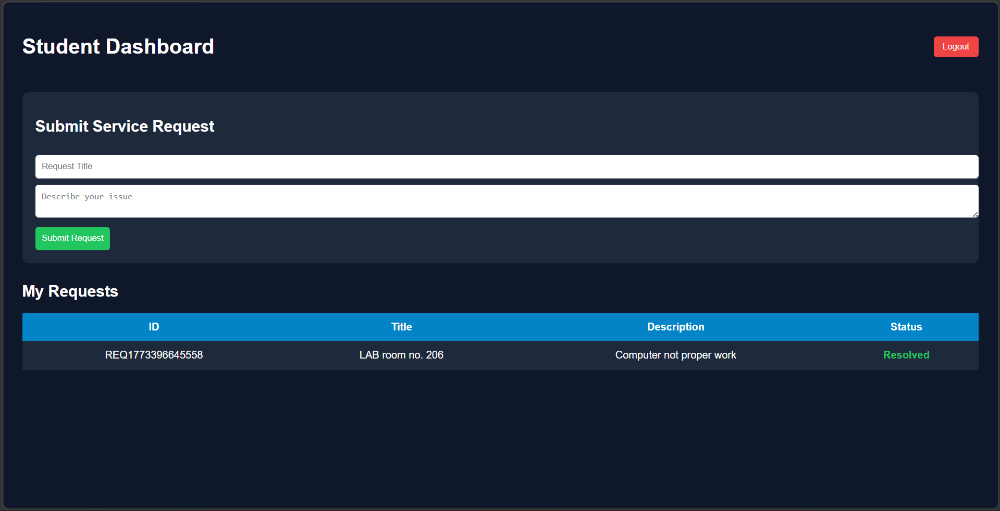
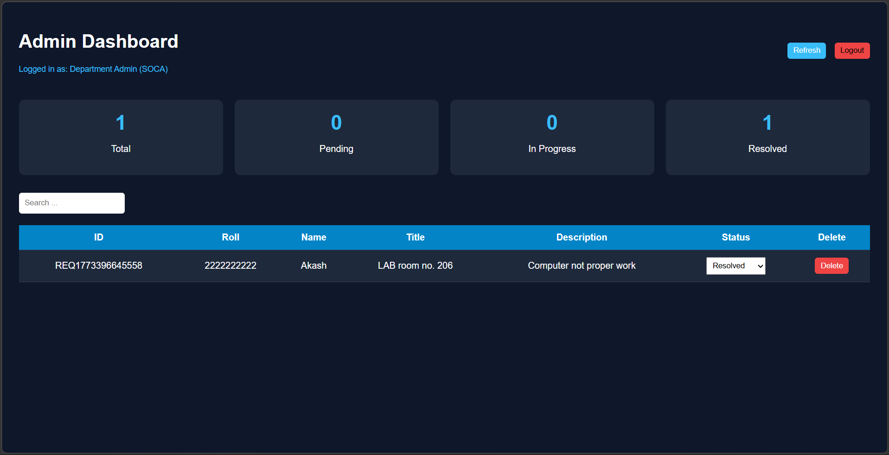
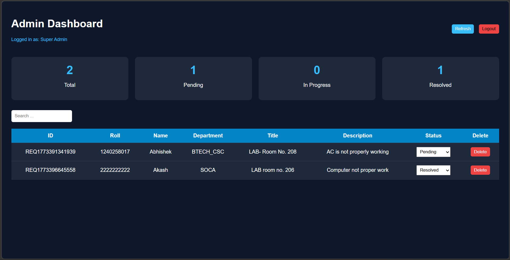

# Live Demo: https://your-project-link

# 🚀 Service Request Management Portal

A **web-based Service Request Management System** developed during a hackathon to simplify how service issues are reported, tracked, and resolved within an institution or organization.

The platform enables **students to submit service requests** and allows administrators to manage them efficiently using a **role-based access system**.

---

# 📌 Problem Statement

In many institutions, service requests such as facility issues, technical problems, or administrative requests are handled manually.  
This often results in:

- Delayed responses
- Lack of transparency
- Difficulty in tracking issue resolution

---

# 💡 Proposed Solution

The **Service Request Management Portal** provides a centralized digital system where:

- Students can submit service requests easily
- Department admins can manage department-specific issues
- Super admins can monitor the entire system

This ensures **better tracking, accountability, and faster issue resolution**.

---

# 👥 User Roles

### 🎓 Student
- Submit service requests
- Track the status of submitted requests

### 🧑‍💼 Department Admin
- View requests related to their department
- Update request status  
  - Pending  
  - In Progress  
  - Resolved  

### 👑 Super Admin
- Monitor requests across all departments
- Manage the entire system workflow

---

# ⚙️ Tech Stack

### Frontend
- HTML
- CSS
- JavaScript

### Backend
- Google Apps Script (GAS)

### Database
- Google Sheets

---

# 🔄 System Workflow

1️⃣ Student submits a request through the portal form.

2️⃣ The request data is stored in **Google Sheets** via **Google Apps Script**.

3️⃣ Department Admin views requests related to their department.

4️⃣ Admin updates the request status.

5️⃣ Student can check the updated request status.

6️⃣ Super Admin monitors all departments and manages the system.

---

# ✨ Key Features

✔ Role-Based Access Control  
✔ Request Tracking System  
✔ Department-wise Issue Management  
✔ Centralized Data Storage  
✔ Simple and User-Friendly Interface  

---

# 🏗 System Architecture

- Student Portal → Request Form
    ↓
- Google Apps Script (Backend API)
    ↓
- Google Sheets (Database)
    ↓
- Admin Dashboard
    ↓
- Status Update → Student View

---

## 📸 Project Screenshots

### Student Request Form

### Admin Dashboard

### Super Admin Panel

---

# 🚀 Future Improvements

- Email notifications when request status changes
- Secure login and authentication
- Mobile responsive UI
- Dashboard analytics for admins
- Integration with cloud databases (MongoDB / Firebase)

---

# 👨‍💻 Team Members

### Ajay
GitHub: https://github.com/YOUR_GITHUB  
LinkedIn: https://linkedin.com/in/YOUR_LINKEDIN

### Team Member 2
GitHub: https://github.com/MEMBER2  
LinkedIn: https://linkedin.com/in/MEMBER2

### Team Member 3
GitHub: https://github.com/MEMBER3  
LinkedIn: https://linkedin.com/in/MEMBER3

---

# 🏆 Hackathon Project

This project was developed during a **University Hackathon Event** where teams built solutions for real-world problems within a limited time.

---

# 📜 License

This project is created for **educational and demonstration purposes**.
